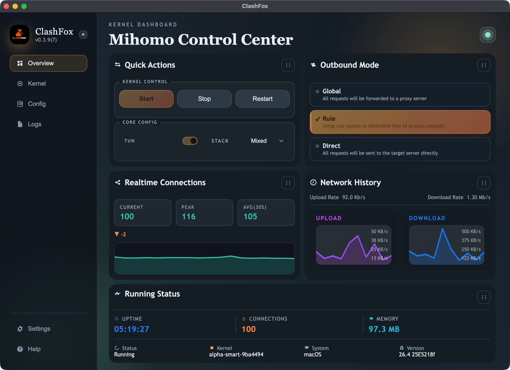
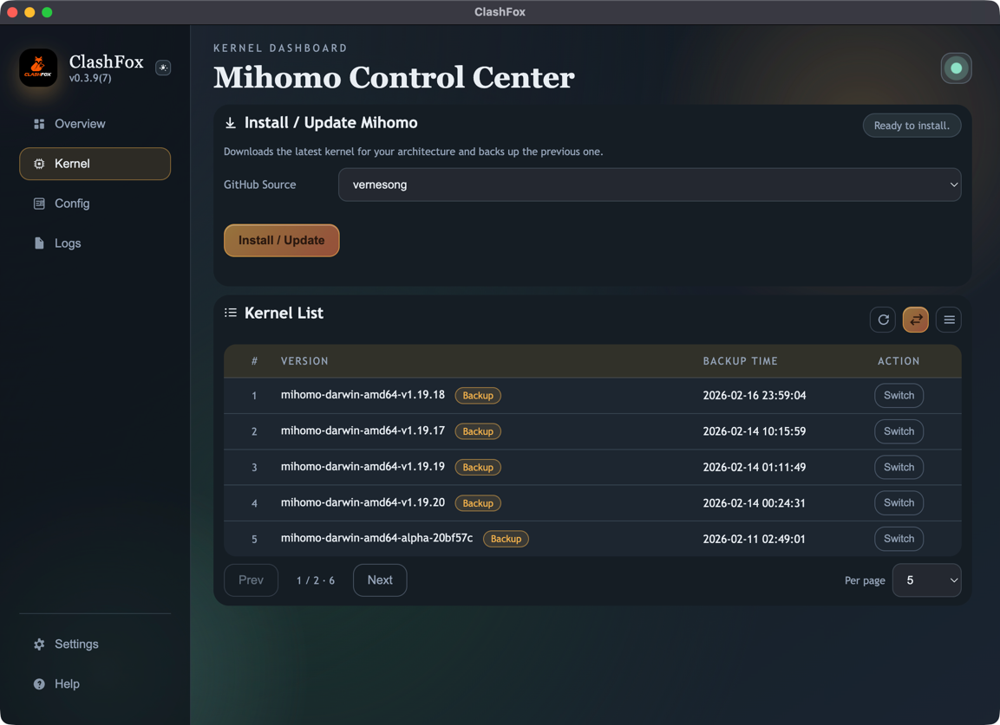
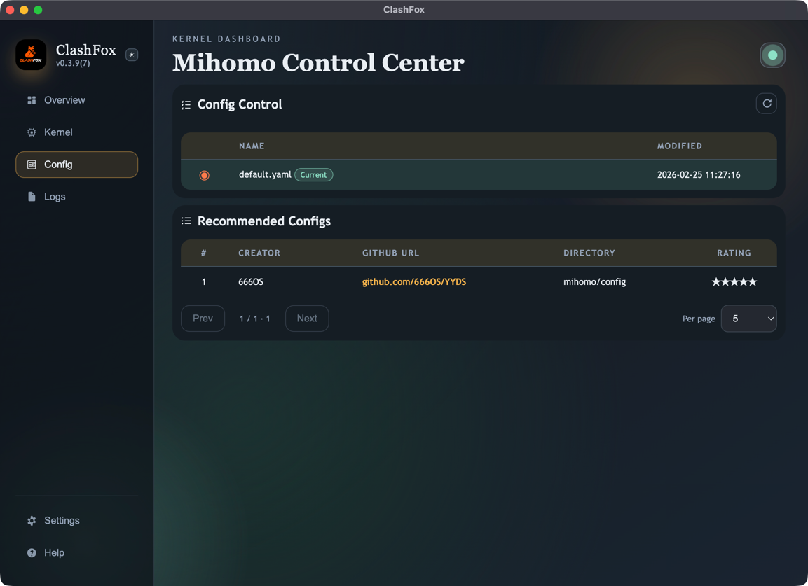
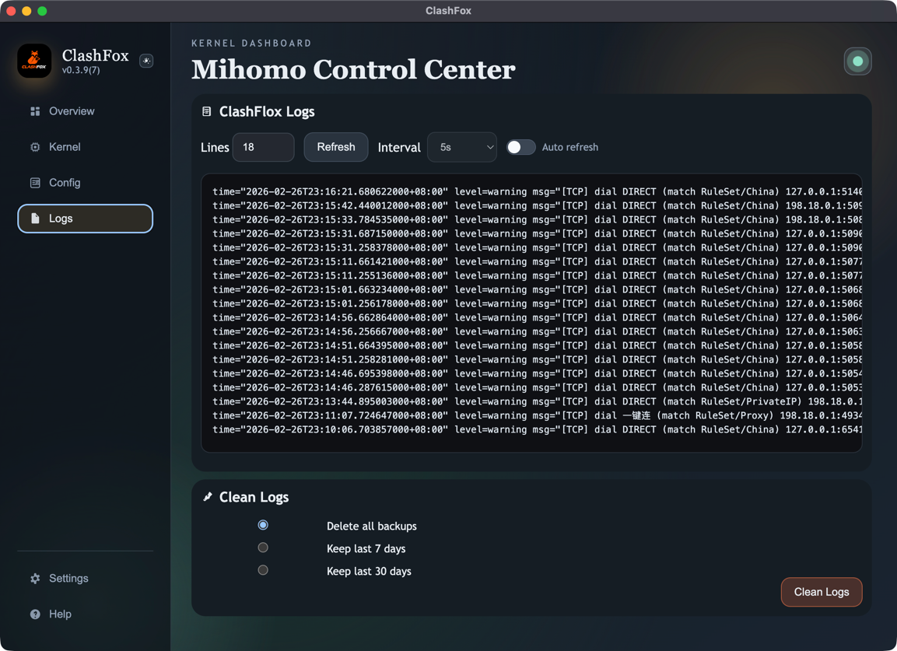
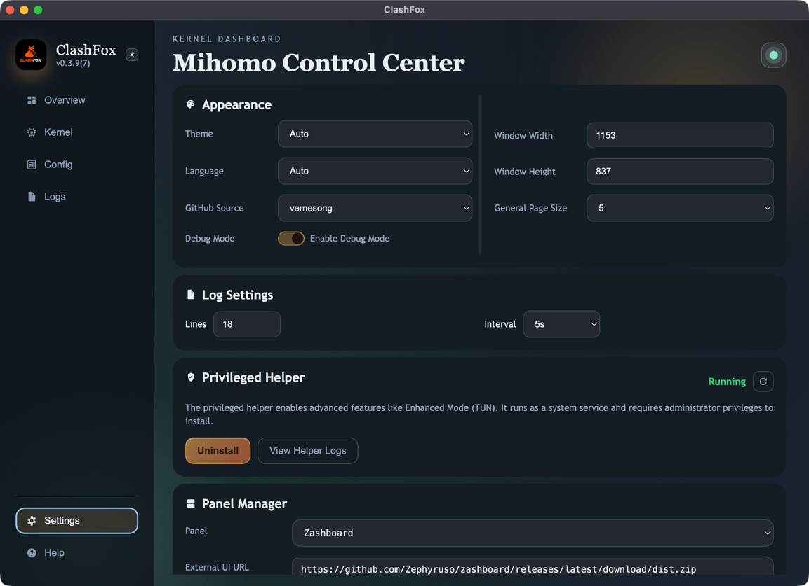
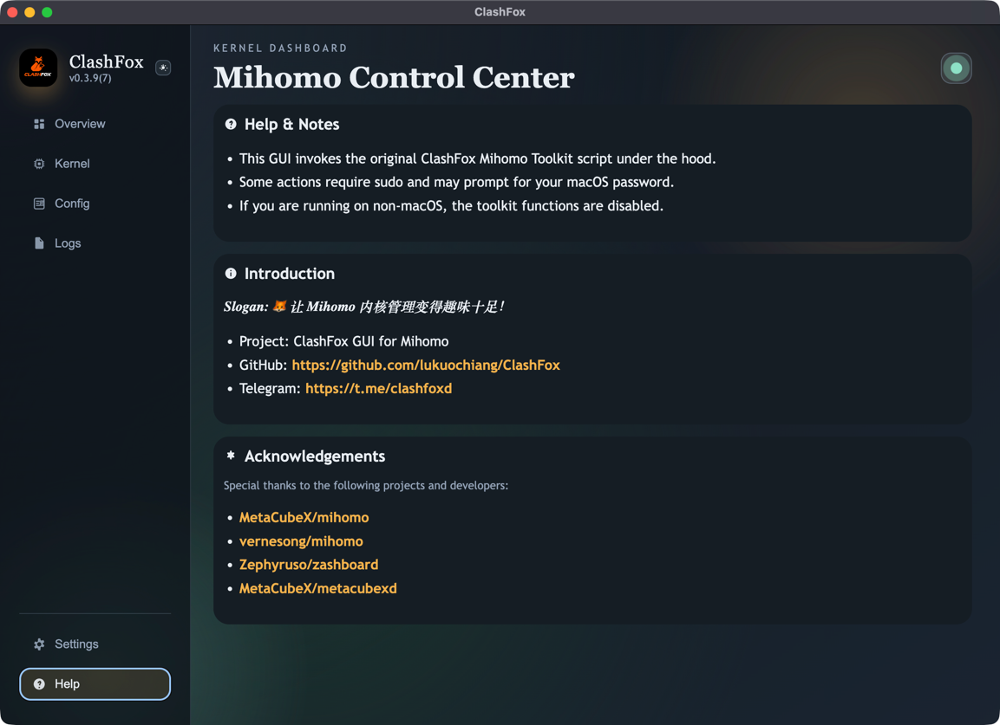

  

# ClashFox - Native Proxy

## Overview

This repository includes an Electron GUI that wraps the ClashFox Mihomo Toolkit Script.
本仓库包含一个 Electron 图形界面，用于封装 ClashFox Mihomo 工具脚本。

## Requirements

- Node.js 20+
- npm 10+
- macOS (for full toolkit/helper capability)
- 需要 macOS 以获得完整工具链和 helper 能力

## App Screenshots
## 应用截图

| Overview | Kernel |
| --- | --- |
|  |  |
| Config | Logs |
|  |  |
| Settings | Help |
|  |  |

## Acknowledgements

Special thanks to the following projects and developers:
特别感谢以下项目与开发者：

- [MetaCubeX/mihomo](https://github.com/MetaCubeX/mihomo)
- [vernesong/mihomo](https://github.com/vernesong/mihomo)
- [Zephyruso/zashboard](https://github.com/Zephyruso/zashboard)
- [MetaCubeX/metacubexd](https://github.com/MetaCubeX/metacubexd)

## License

This project is licensed under the GNU General Public License v3.0 (`GPL-3.0`).
本项目采用 GNU General Public License v3.0 (`GPL-3.0`) 开源协议。

### You Are Free To

- Use the software for any purpose
- Study and modify the source code
- Distribute copies of the original or modified software
- 你可以将本软件用于任何目的
- 你可以学习并修改源代码
- 你可以分发原始版本或修改后的版本

### Conditions

- Any distributed copies or derivative works must also be licensed under `GPL-3.0`
- The complete corresponding source code must be made available when distributing binaries
- The original copyright and license notices must be preserved
- 分发副本或衍生作品时，必须继续使用 `GPL-3.0`
- 分发二进制时，必须提供完整对应源代码
- 必须保留原始版权声明与许可声明

Full license text: [GNU GPL v3.0](https://www.gnu.org/licenses/gpl-3.0.en.html)
完整协议文本：[GNU GPL v3.0](https://www.gnu.org/licenses/gpl-3.0.en.html)

### Third-Party Software Notice

This project does not bundle, distribute, or modify `mihomo`.
本项目不捆绑、不分发、也不修改 `mihomo`。

Users are required to install `mihomo` separately. `mihomo` is an independent project and is licensed under its own license.
用户需要自行安装 `mihomo`。`mihomo` 为独立项目，并遵循其自身许可证。

This repository only provides:
本仓库仅提供：

- Installation automation
- Configuration management
- macOS integration (e.g., LaunchDaemon helper)
- User interface components
- 安装自动化
- 配置管理
- macOS 集成（例如 LaunchDaemon helper）
- 用户界面组件

No `mihomo` source code or binary is included in this repository.
本仓库不包含 `mihomo` 的源代码或二进制文件。

### Disclaimer

This software is provided "as is", without warranty of any kind.
The authors are not responsible for any misuse, damages, or legal issues resulting from the use of this software.

Users are solely responsible for complying with local laws and regulations.
本软件按“原样”提供，不提供任何形式担保。
作者不对因使用本软件导致的误用、损害或法律问题负责。
用户需自行承担遵守所在地法律法规的责任。

## Star History

---

**ClashFox** - 让 Mihomo 内核管理变得趣味十足！
