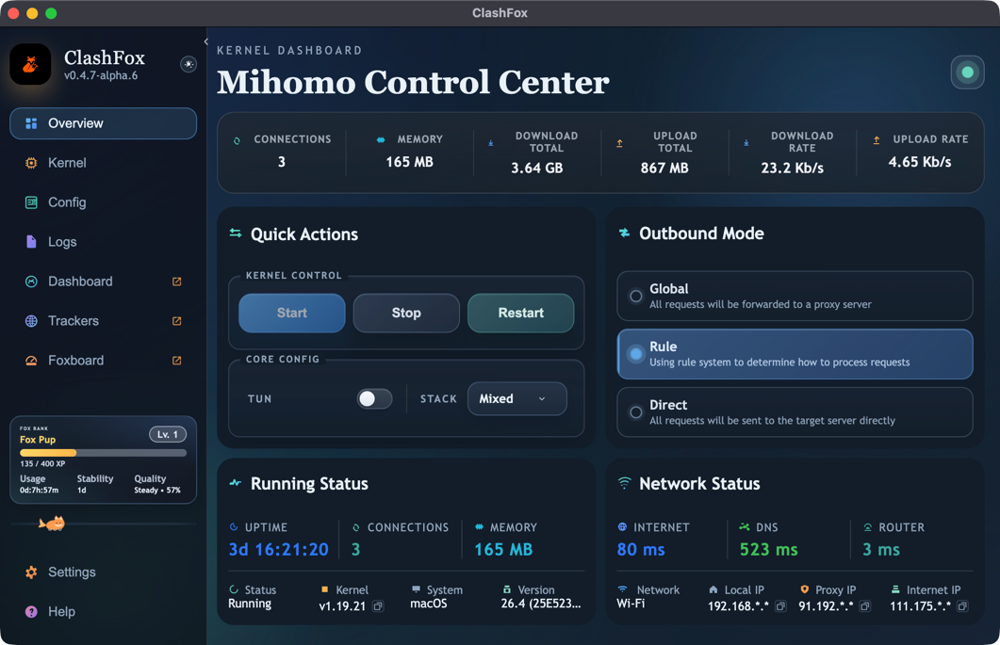
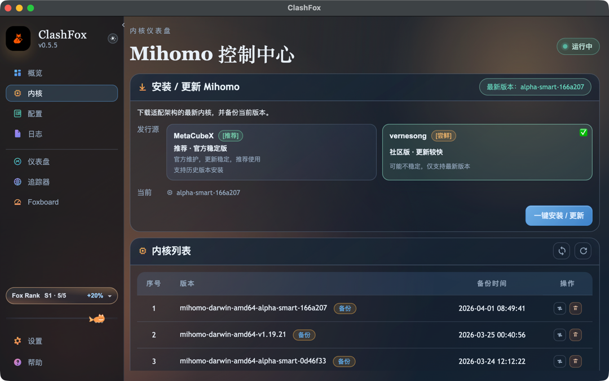
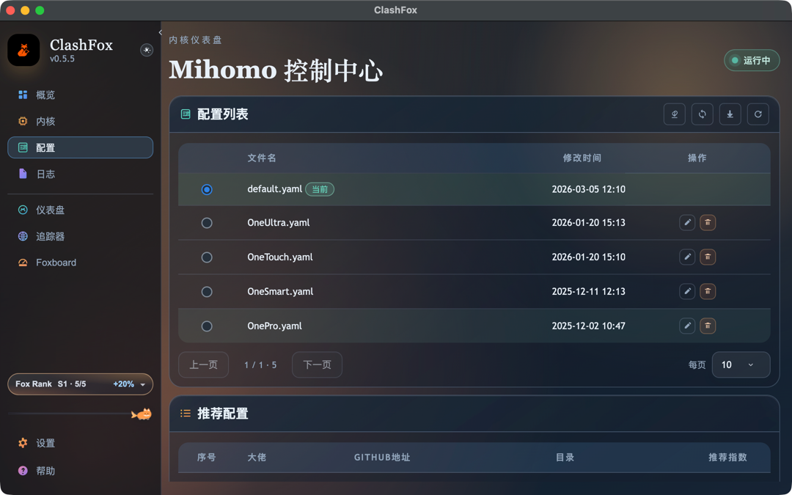
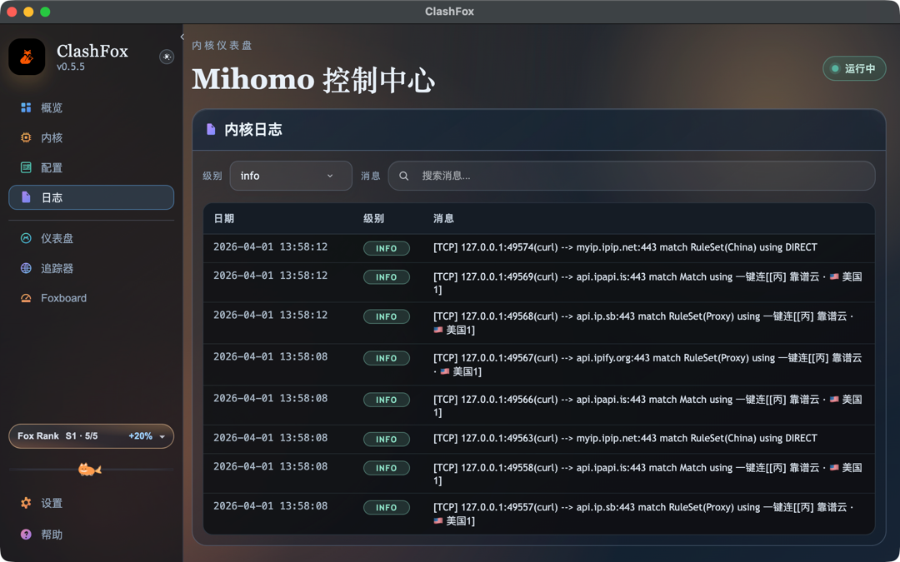
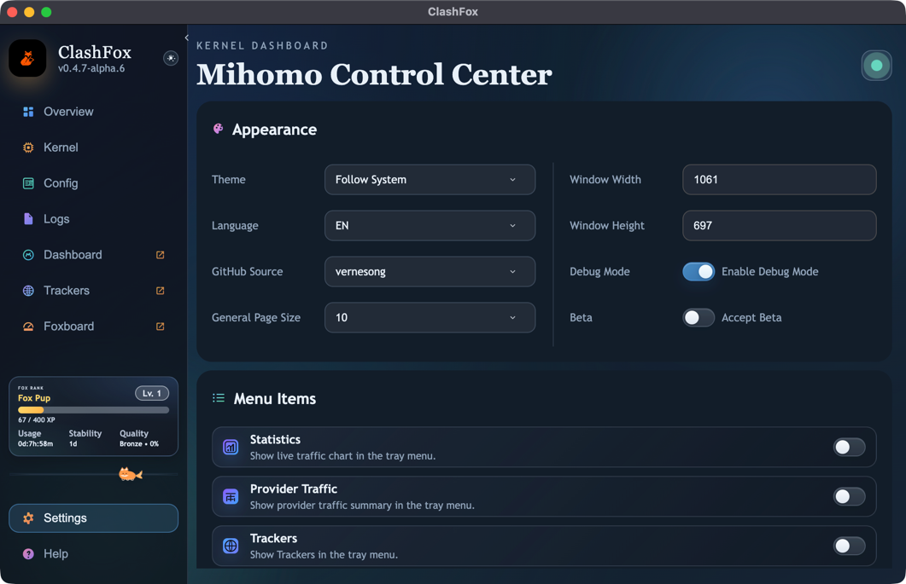
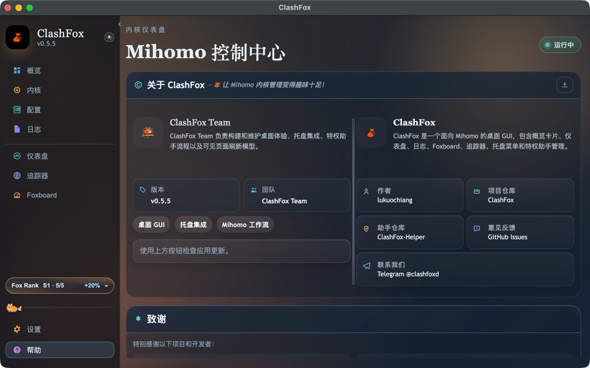
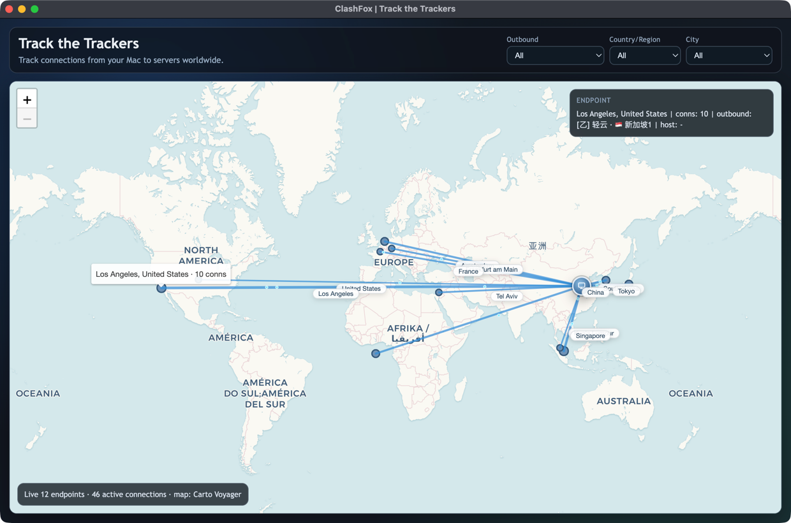
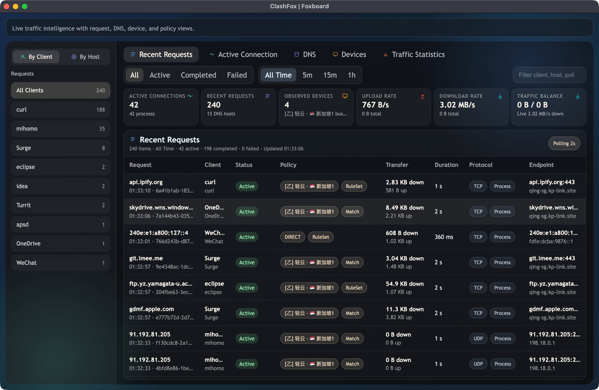

  

# ClashFox - Native Proxy

## Overview

ClashFox is a modern Electron-based GUI that provides a user-friendly interface for managing the Mihomo (Clash Meta) kernel. It offers a comprehensive toolkit for configuration, monitoring, and control, with native macOS integration and advanced features.

## Features

- **Modern GUI**: Clean and intuitive Electron-based interface
- **Kernel Management**: Full control over Mihomo kernel lifecycle
- **Configuration Editor**: Powerful config editing with syntax highlighting
- **Real-time Logs**: Live log monitoring and filtering
- **MacOS Integration**: Native LaunchDaemon helper for background service
- **Foxboard Dashboard**: Advanced traffic monitoring and analytics
- **Tracker Support**: Connection tracking and statistics

## Requirements

- Node.js 20+
- npm 10+
- macOS (recommended for full toolkit/helper capability)

## App Screenshots

| Overview                                                                      | Kernel                                                                    |
|-------------------------------------------------------------------------------|---------------------------------------------------------------------------|
|  |  |
| Config                                                                        | Logs                                                                      |
|      |      |
| Settings                                                                      | Help                                                                      |
|  |      |
| Trackers                                                                      | Foxboard                                                                  |
|  |  |

## Acknowledgements

Special thanks to the following projects and developers:

- [MetaCubeX/mihomo](https://github.com/MetaCubeX/mihomo)
- [vernesong/mihomo](https://github.com/vernesong/mihomo)
- [Zephyruso/zashboard](https://github.com/Zephyruso/zashboard)
- [MetaCubeX/metacubexd](https://github.com/MetaCubeX/metacubexd)

## License

This project is licensed under the GNU General Public License v3.0 (`GPL-3.0`).

[View full license text](https://www.gnu.org/licenses/gpl-3.0.en.html)

### Third-Party Software Notice

This project does not bundle, distribute, or modify `mihomo`. Users must install `mihomo` separately. `mihomo` is an independent project licensed under its own terms. This repository only provides:

- Installation automation
- Configuration management
- macOS integration (e.g., LaunchDaemon helper)
- User interface components

No `mihomo` source code or binary is included in this repository.

### Disclaimer

This software is provided "as is", without warranty of any kind. The authors are not responsible for any misuse, damages, or legal issues resulting from the use of this software. Users are solely responsible for complying with local laws and regulations.

## Star History

---

  <strong>ClashFox - Make Mihomo kernel management a lot of fun!</strong>

